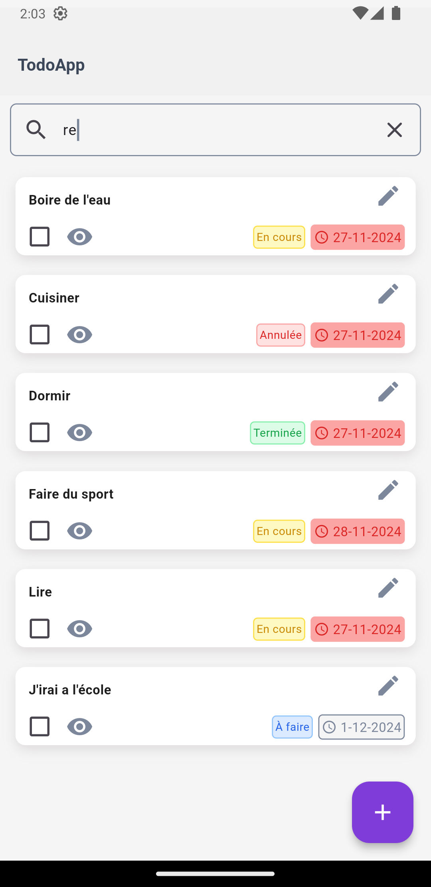
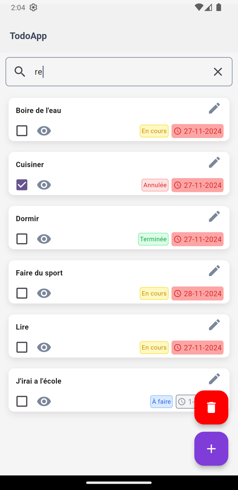

# 📝 To-Do Application

Une application multi-plateforme pour la gestion des tâches, développée avec **Angular** pour le front-end web et **Flutter** pour le mobile.

---

## 🌟 Fonctionnalités

- Ajouter, modifier et supprimer des tâches.
- Rechercher des tâches par titre ou description.
- Statuts personnalisés avec des codes couleur :
  - **TODO** (À faire)
  - **DOING** (En cours)
  - **DONE** (Terminée)
  - **CANCELLED** (Annulée)
- Interface responsive pour le web.
- Application mobile Flutter offrant une expérience utilisateur native.
- Traduction dans plusieurs langues.

---

## 📂 Structure du projet

```plaintext
root/
├── web/       # Version Angular
│   ├── src/
│   │   ├── app/        # Composants Angular
│   │   └── assets/     # Fichiers statiques
│   └── package.json    # Dépendances Angular
├── mobile/       # Version Flutter
│   ├── lib/
│   │   ├── screens/    # Écrans principaux
│   │   ├── widgets/    # Widgets réutilisables
│   └── pubspec.yaml    # Dépendances Flutter
└── README.md           # Ce fichier
```
## 🚀 Installation et Lancement
### Angular (Web)
Cloner le projet :
```bash
git clone https://github.com/RanylFoumbi/Projet-web-2.git
cd web
```
Installer les dépendances :
```bash
npm install
```
Lancer le projet :
```bash
ng serve
```
Le projet sera accessible à http://localhost:4200.

### Flutter (Mobile)
Cloner le projet :

```bash
git clone https://github.com/RanylFoumbi/Projet-web-2.git
cd mobile
```
Installer les dépendances :
```bash
flutter pub get
```
Exécuter l'application :
```bash
flutter run
```
L'application s'exécutera sur un simulateur ou un appareil connecté.

## Aperçu de l'application
| Créer une tâche | Menu home | Recherche | Détails de tâche |
| --------------------------------------------------- | --------------------------------------------------- | --------------------------------------------------- | --------------------------------------------------- |
|  |  |  |  |

## 🎨 Charte graphique

Voici les styles utilisés pour les statuts dans l'application Angular :

| Statut        | Bordure  | Fond     | Texte    |
|---------------|----------|----------|----------|
| **TODO**   | `#FDE047` | `#FEF9C3` | `#CA8A04` |
| **DONE** | `#86EFAC` | `#DCFCE7` | `#16A34A` |
| **DOING** | `#93C5FD` | `#DBEAFE` | `#2563EB` |
| **CANCELLED**  | `#FCA5A5` | `#FEE2E2` | `#DC2626` |

## 🛠️ Technologies Utilisées
**Angular**: Framework front-end pour le web.
**Flutter**: SDK mobile pour créer des applications natives.
**Firebase**: Backend pour la gestion des données.

## 📱 Aperçu de l'application


## 📜 Licence
Ce projet est sous licence MIT.
